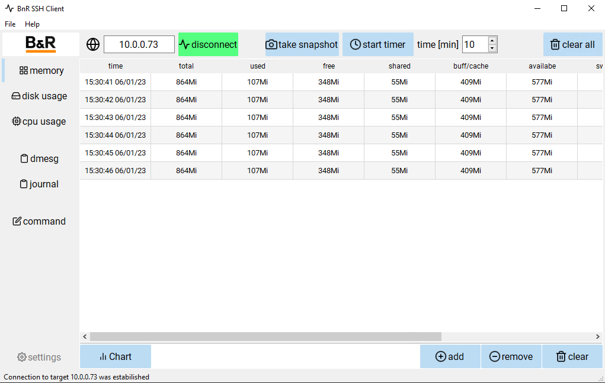

## Table of Contents
* [Introduction](#Introduction)
* [Features](#Features)
* [Requirements](#Requirements)
* [Revision History](#Revision-History)

## Introduction
This is an SSH client developed to simplify the investigation of possible troubles of BnR Linux based hw as T-series, C-series. You can either take a single system overview snapshot or take it cyclically for a longer time period. So it is useful for investigation e.g. of possible memory leaks. <b>SSH ppt image must be installed on this target</b>. It is developed and maintained by the author of this app but is not an official B&R product. For a detailed description see wiki [**documentation**](https://github.com/jaroslavkovar80/SSHClient/wiki). 

***
**Note:** _If you want to run only the app without Python installation, please download <b>SSHClient.exe</b> from folder dist. It is a single package (portable) with all dependencies created for Windows OS. So this runs out of the box._
***

## Features

* Memory overview (table + chart)
* Disk usage overview (table)
* CPU usage overview (table)
* dmesg logger
* journal
* manual command execution
* export to excel

## Requirements (current used versions)
SSH PPT image must be installed on a target, for more info ask at 2nd level HMI support.
Implementation itself is based on
* Python 3.9 + packages
* PyQT 5 + PyQTChart
* Paramiko (SSH client)

#### Version 1.0.3
- First public release
