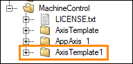
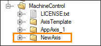
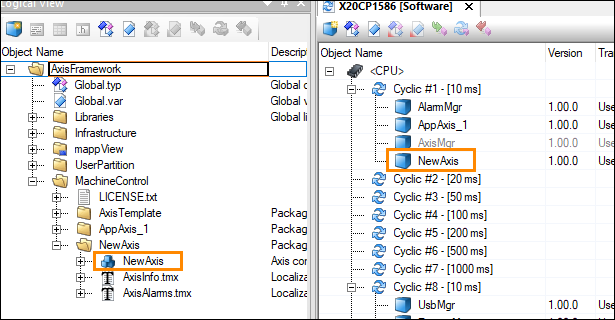
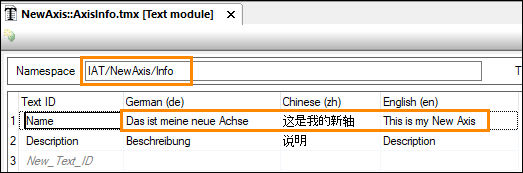
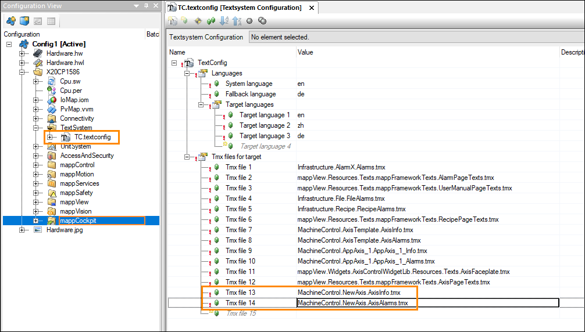
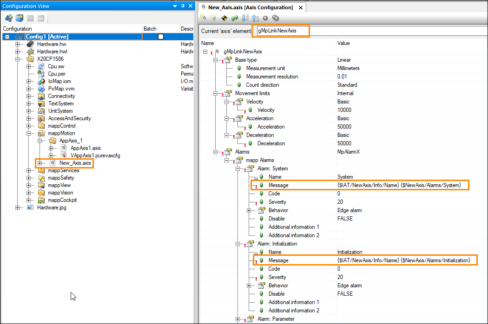
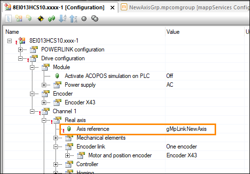

## Adding additional axis

Here are the steps to add a new axis to the project using the provided axis template:

1. Copy the AxisTemplate package that is located in the MachineControl package of the Logical View. Paste it into the MachineControl package. 

2. Rename the copied package. (Note: for the rest of these steps, the copied package will be referred to as the "NewAxis" package.)

3. Rename the contained AxisMgr task to match the new package name. Deploy this task to the Software Configuration.

4. In AxisInfo.tmx of the NewAxis package:
  1. Change the namespace to something unique (make sure it starts with "IAT/").
  2. Modify the value of the text ID “Name” to describe the axis.

5. In AxisAlarms.tmx of the NewAxis package:
  1. Change the namespace to something unique.
  2. Delete all existing entries. Generic axis alarms are handled by the AxisTemplate package.
  3. Add entries to correspond to alarm messages as needed.

6. In the Configuration View → TextSystem →TC.textconfig, add the two text files from step 4 and 5 to the "Tmx files for target" list. 

7. In the Configuration View, copy/paste AppAxis_1.axis file in the mappMotion package. Re-name the copied file. (Note that the renamed file cannot exactly match the name of the corresponding task in the Logical View.) Then execute the following steps within the copied file:
  1. Re-name the MpLink as desired
  2. Update the namespace references in the Alarms section to the namespaces you chose in steps 4.1 and 5.1. Alternatively, you can open the .axis file in a text editor and do a find-and-replace. The namespace is identified with the ‘$’ within the first set of curly brackets. For example: {$Namespace/TextID}

8. Optional: If you are planning to run the axis in simulation, then also copy/paste the VAppAxis1.purevaxcfg file from within the AppAxis_1 package in the Configuration View. Then execute the following steps within the pasted file:
  1. Rename the MpLink
  2. Assign the axis reference to the MpLink from step 9.1.

9. In the Logical View → MachineControl package → NewAxis package → AxisMgr.st, update the MpLink reference on line 33 to the name you chose in step 9.1. 

10. In the Configuration View → mappServices package, copy/paste the AppAxis_1 package. Rename the copied package. Then execute the following steps within the two contained files: 
  1. Rename the .mpalarmxcore file accordingly. Within this file, re-name the MpLink. Then in AxisMgr.st on line 42, paste this new MpLink.
  
  

  2. Rename the .mpcomgroup file accordingly. Within this file:
   1. Rename the MpLink of the group accordingly.
   2. Change the Child 1 element to match the new MpLink from step 7.1. 
   3. Change the Child 2 element to match the new MpLink name you created step 10.1.

   

11. If you are not running a virtual axis, then in the Physical View, in the drive configuration that corresponds to this axis, set the axis reference to the MpLink you named in step 7.1. 

Note that in a future version of the Framework, this process will be more automated. 

