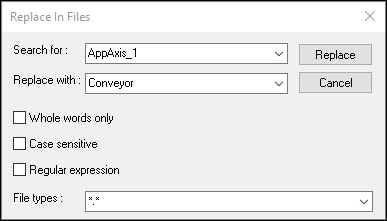

## Rename AppAxis_1

Here are the steps to rename the provided AppAxis_1 to something more specific to the application: 

1. Choose a name that is 10 characters or less.
2. Do a replace-in-files (Edit→ Find and Replace → Replace in Files) to replace all instances of AppAxis_1 with your new name. Make sure the box for "Whole words only" is NOT checked, and the file types filter is set to *.*.Check the picture   

3. Manually rename the following files/packages in the Logical View → MachineControl package to your new name:
    1. AppAxis_1 package
    2. AppAxis_1 task
    3. AppAxis_1_Info.tmx
    4. AppAxis_1_Alarms.tmx
4. In the Configuration View → Connectivity → OpcUA, open up Axis.uad in a text editor. On line 36, replace AppAxis_1 with your new name. 
5. In the Configuration View → TextSystem, open up TC.textconfig in a text editor. Replace all instances of AppAxis_1 with your new name (4 instances total). 
