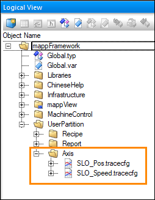

## SLO Trace configuration

Two trace configurations are included in the Axis framework - one for position and the other for speed. Since only one trace configuration can be included in the mapp Cockpit package in the Configuration View at a time, these two trace configurations are delivered via the UserPartition\Axis package in the Logical View:

To use these files (one at a time), follow these steps: 

1. From Windows Explorer, copy the preconfigured .tracecfg file that you'd like to use to the mappCockpit folder in the Configuration View. (AS won't allow you to copy the file directly)

2. Open up the trace configuration file within the mappCockpit package. Update the "Data point" station address entries according to the drive you want to trace. 

3. The rest of the trace implementation is done in mapp Cockpit. See here and here. In short, select "Autotune" (for either the speed controller or position controller, depending on which trace configuration you're using) and then turn the "Signal order" up to 11. 

4. To use the second preconfigured trace file, delete the first file you traced from the mappCockpit package and then start over from step 1. 

