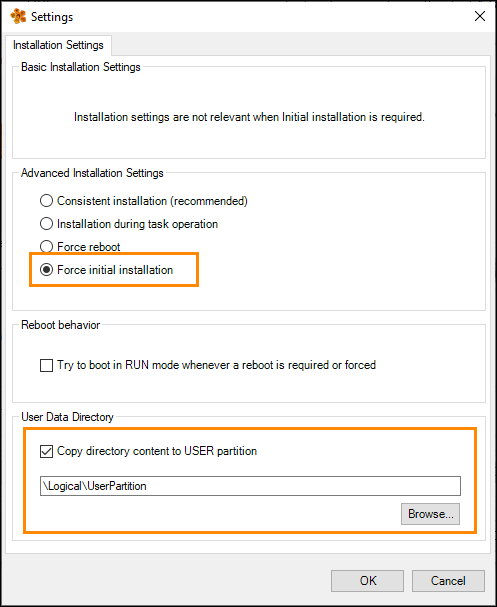

## 🔧 Required Modifications

The Framework by default provides a solid foundation, but in order to integrate it fully into your application there are a few modifications that must be made.  
The following list of modifications are required to get the Framework in a functional state within the application.

> 🚨 **IMPORTANT:**  
>  The steps on this page must be executed in order to get the Framework into a functional state!
>

---

1.**Two default recipes** (**"Machine.mcfg"** for machine settings and **"Default.par"** for product data) must exist in the **mappRecipeFiles** file device at startup.Initial versions of these files are provided for reference in the **Logical View**  (**UserPartition → Recipe → CSVformat** and **UserPartition → Recipe → XMLformat**).

Only the files that are directly in the **UserPartition → Recipe** package will be loaded by the recipe system (which by default is the **XML** file format).

2.Modify the **structure types** within **RecipeMgr.typ** for each registered variable to suit the needs of the application.

*  **Parameters_type** is used to hold the **product data**   

*  **MachineSettings_type** is used to hold the **machine settings / commissioning data** 

Further information about the design of the recipe system is provided here. 

3.Create new **default recipes** that contain the updated structure types from step **2**.   

To do so: 

* 1. **Transfer** to the target. 

* 2. On the **HMI**, log in as **Admin**. 

* 3. On the **Recipe content**, create a **new recipe**. Do not worry about populating values at this step. 

* 4. Navigate to the **mappRecipeFiles** file device  (by default, **USER_PATH:\Recipe**). Open the newly created recipe in a text editor and edit the **default values** for the recipe parameters as needed. Then **copy / paste** this recipe file into the **UserPartition** package in the **Logical View**. 

* 5. Delete the existing **default recipe** present in the **UserPartition** package in the **Logical View**  (either **Default.par** or **Machine.mcfg**). Then rename your new file to the appropriate default recipe name (either **Default.par** or **Machine.mcfg**). 

* 6.Perform an **initial transfer**, taking care to transfer the contents of **\Logical\UserPartition** to the **USER** partition.

   

4.The **Recipe Framework** uses **retained variables**, which require **nonzero remanent memory**. This must be configured in the **CPU memory configuration** if it is not already configured. 

5.Change the passwords for the **Admin**, **Operator**, and **Service_Tech** users.This is done in the **User.user** file in the **Configuration View** (**AccessAndSecurity → UserRoleSystem → User.user**). Note that if you already had users in your project with these same names prior to import, your existing users will remain unchanged and you do not need to update the passwords. 

6.If you imported the **mapp View front end** with the Framework: 

* Assign the **mapp View content** (content ID = **Recipe_content**) to an area on a page within your visualization. 

* On **RecipePars.content** and **RecipeMachConfig.content**, each recipe parameter is linked to one of **three compound widgets**  (Boolean, Numeric Values, and String).These widgets contain elements for **active parameters**, **preview values**, and **inputs for editing values**. These contents are loaded into the **Preview window** **Recipe.content**, depending on the category selection. 

* Several changes must be made on these two contents: 

---* Change the text for the **compound widget label** to provide a meaningful description of the recipe parameter.   The texts are located in **RecipeParTexts.tmx**. 

---* Confirm that the **widgets match the datatype** of your recipe parameter. If not, exchange them with a matching compound widget. 

---* Adjust the **bindings on the output widgets** to connect to your recipe variables. Keep in mind the **recipe system design**. 

---* If you need to display **more than five recipe parameters**, add additional compound widgets from the **Toolbox**   and **RecipeWidgetLib** for each additional parameter and  create texts / bindings as described above. 

---* Each **Recipe compound widget** is designed to be configured like a standard widget. You can configure standard properties such as **format**, **unit**, and **min / max value**. 

* RecipeDialog_NewPars.content and RecipeDialogEditPars.content are used to create and edit parameter recipes. Both are using a ContentControl widget reusing the RecipePars.content, therefore all settings, labels and bindings are the same. The visibility of Edit inputs vs Preview and Active outputs are controlled through behavior inputs of the compound widget 

* **RecipeDialog_NewMachConfig.content** and **RecipeDialog_EditMachConfig.content** are used to create and edit  **machine settings recipes**. Both use **ContentControlwidget** reusing **RecipeMachConfig.content**, therefore all settings, labels, and bindings are the same. The visibility of **Edit inputs** versus **Preview and Active outputs** is controlled through behavior inputs of the compound widget. 

* The ability to **create / delete / edit a recipe** on the **mapp View HMI** is restricted to the    **Administrators** or **Service** roles.The ability to **load a recipe** is restricted to the **Administrators**, **Service**, or **Operators** roles. Therefore, add a way to **log in on the HMI** (for example, by importing the **mapp UserX** framework).

7.If you did **not** import the mapp View front end with the Framework,  connect the **HmiRecipe** structure elements to your visualization accordingly.