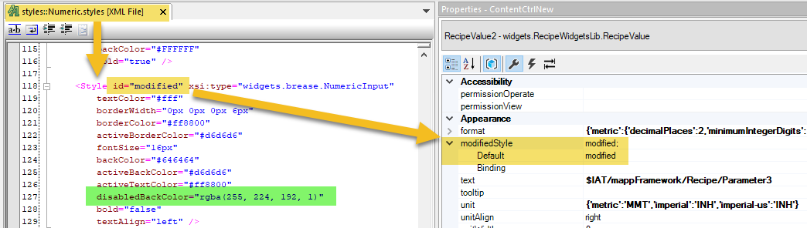

There are **two recipe categories** in this recipe system: **"Parameters"** and **"Machine Configuration"**.

* Each category gets saved to its **own recipe file**.

* One **structure variable** is registered to each category.

  o **Parameters_type** holds the **product data**.

  o **MachineSettings_type** holds the **machine data**.

* **Three variables of each datatype** are used in order to accomplish the **preview functionality**  
  and the ability to **edit a recipe without formally loading it**.   
  For example, let’s focus on the **parameters structure**: 

  o The variable **Parameters** is the actual variable structure that holds the **active recipe**,  
    which should be used throughout the application.This variable is **not directly registered** to the recipe. 

  o The variable **ParametersPreview** is the **only variable registered** to the **Product** category of the recipe.  
    This allows you to **load and preview recipes** without activating them in the application. If a recipe should be loaded to the application, then the **Parameters** structure is set equal to  
    the **ParametersPreview** structure by the Framework. 

  o The variable **ParametersEdit** is used as an **intermediary structure** to allow editing a recipe  
    without loading it into the application. It also acts as a **buffer** between the registered variable, allowing you to **discard changes** while editing if needed. 
    
  o The **custom compound widgets** used to display **Active** and **Preview** values also incorporate a  
  **value compare feature**.The widget compares the selected **recipe preview values** with the **active recipe values**, and if they differ, changes the **background of the preview value**. This background change is accomplished by modifying the **style of the standard widget** using the **modifiedStyle** setting under **Appearance** of the compound widget. 
  
---

ℹ️ **Note**

Note that the **Recipe Framework** contains some **While loops** in the **Initialization program**, whereas the other Frameworks do not.

The reason for this is that the Framework **loads the default recipes** in the Initialization program. As a result, the supporting **function blocks must be active** before the load command can be successfully triggered. 

The default recipes are loaded in the **Initialization program** rather than the **Cyclic program** to avoid the need for a **global variable across the Frameworks** to indicate when the recipes have finished loading.